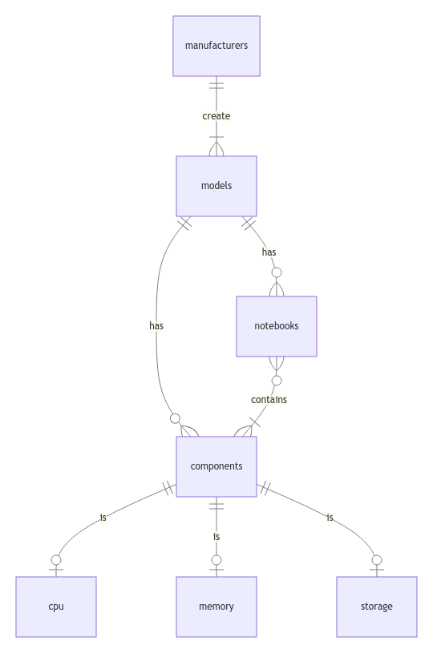

# Design Document

By M Naufal Shidqi

Video overview: https://youtu.be/WmadbqmZM2I

## Scope

In this section you should answer the following questions:

- What is the purpose of your database?
- Which people, places, things, etc. are you including in the scope of your database?
- Which people, places, things, etc. are _outside_ the scope of your database?

This database created to make it easier to find notebooks with a specific hardware. It contains eight `table`, `manufacturers`, `models`, `notebooks`, `components`, `contains`, `cpus`, `memories` and `storages`. `manufacturers` stores all notebooks and components manufacturers. `models` stores all manufacturers released models for notebooks and components. `notebooks` stores all notebooks. `components` stores some components that makes up a notebook in `notebooks`. `contains` is a relation table that connect `notebooks` and `components`. `cpus` stores components from `components` that are CPUs. `memories` stores components from `components` that are memory. `storages` stores components from `components` that are storage. For this projects I limit to notebook and 3 type of components but you can imagine adding like display, GPU, camera etc. There are also no user entity in this database.

## Functional Requirements

In this section you should answer the following questions:

- What should a user be able to do with your database?
- What's beyond the scope of what a user should be able to do with your database?

The user can look up which notebook that has certain components, which has certain component that fulfill certain criteria, which produced by certain manufacturer, which part of a certain models. But it can't find where it's sold, it can't find with hardware that isn't present in database and it can't find with manufacturers or model special features, it can't see what other thinks about a notebook.

## Representation

### Entities

In this section you should answer the following questions:

- Which entities will you choose to represent in your database?
- What attributes will those entities have?
- Why did you choose the types you did?
- Why did you choose the constraints you did?

There are seven entities in this database, `manufacturers`, `models`, `notebooks`, `components`, `cpus`, `memories`, and `storages`. `manufacturers` has one attribute, `name` with data type `VARCHAR(32)` and constraints `NOT NULL` and `UNIQUE`, manufacturer must have a name and they're unique to each other. `models` has two attributes, `manufacturer_id` with data type `INT` and constraint `FOREIGN KEY` referencing `manufacturers` primary key and `name` with data type `VARCHAR(32)` and constraint `NOT NULL`, model must have a name limit to thirty two characters and not necessarily have to be unique. `notebooks` has four attributes, `name` with data type `VARCHAR(50)` and constraint `NOT NULL`, notebook must have a name limit to fifty characters and doesn't have to be unique, `model_id` with data type `INT` and `FOREIGN KEY` constraint referencing `models` primary key, `year` with data type `DATE` and constraint `NOT NULL` and `price` with data type `DECIMAL(6, 2)` and constraint `NOT NULL` which mean the maximum price it can store is $9999.99. `components` has three attributes, `model_id` with data type of `INT` and constraint `FOREIGN KEY` references `models` primary key, `name` with data type `VARCHAR(32)` and constraint `NOT NULL`, `type` with data type of `ENUM ('cpu', 'memory', 'storage')` and constraint `NOT NULL`.

`cpus` has four attributes, `component_id` with data type `INT` and constraint `FOREIGN KEY` that references `components` primary key, `cores` and `threads` with data type `SMALLINT` and constraint `NOT NULL`, with maximum value of 32767 it's enough to represent CPU cores and threads, `frequency` with data type `DECIMAL(3, 1)` and constraint `NOT NULL`, which means it has maximum value of 99.9 it's sufficient to store frequency value that typically has two digit with one decimal in GHz. `memories` has four attributes, `component_id` with data type `INT` and constraint `FOREIGN KEY` that referencing `components` primary key, `type` with data type `ENUM('ddr3', 'ddr4', 'ddr5')` and constraint `NOT NULL`, `size` with data type `SMALLINT` and constraint `NOT NULL`, size in GB. `clock` with data type `SMALLINT` and constraint `NOT NULL`, memories typically have four digit clock speed in MHz so `SMALLINT` is sufficient. `storages` has five attributes, `component_id` with data type `INT` and constraint `FOREIGN KEY` that referencing `components` primary key, `type` with data type `ENUM ('hdd', 'ssd')` and constraint `NOT NULL`, `size` with data type `SMALLINT` and constraint `NOT NULL`, size in GB, `write_speed` and `read_speed` with data type `SMALLINT` and constraint `NOT NULL`, read and write speed are in between three or four digit value of MB/s.

### Relationships

In this section you should include your entity relationship diagram and describe the relationships between the entities in your database.

  

`manufacturers` has one to many relationship with `models`, manufacturer can have multiple model but model can only have one manufacturer. `models` has one to many relationship with `notebooks` and `components`, model can have multiple component or notebook but component or notebook can only have one model. `notebooks` and `components` has many to many relationship, notebook can have multiple component and the same type component can be used in multiple notebook. `components` has one to one relationship with either `cpus`, `memories` or `storages`, each component can be either CPU, memory or storage but not multiple type.

## Optimizations

In this section you should answer the following questions:

- Which optimizations (e.g., indexes, views) did you create? Why?

The database has five indexes.`search_by_manufactures` that index `name`. `search_by_notebooks` that index `notebooks` `name` and `year`. `search_by_cpus` that index `cpus` `type`, `cores`, `threads` and `frequency`. `search_by_memories` that index `type`, `size` and `clock`. `search_by_storages` that index `type`, `size`, `write_speed` and `read_speed`. Which is typical criteria a customer would search in a notebook. It also has a view `list_all` that join all entity into one table

## Limitations

In this section you should answer the following questions:

- What are the limitations of your design?
- What might your database not be able to represent very well?

This database only use a shared features between notebook or between component, such as number of cores in CPU, CPU frequency, size of memory, storage read and write speed etc. Sometimes manufacturer release a product that has a unique feature than the competitor, that feature can't be used to query the database. It also lack flexibility when adding a new type of component, you have to add new table and type to `component_type`.
